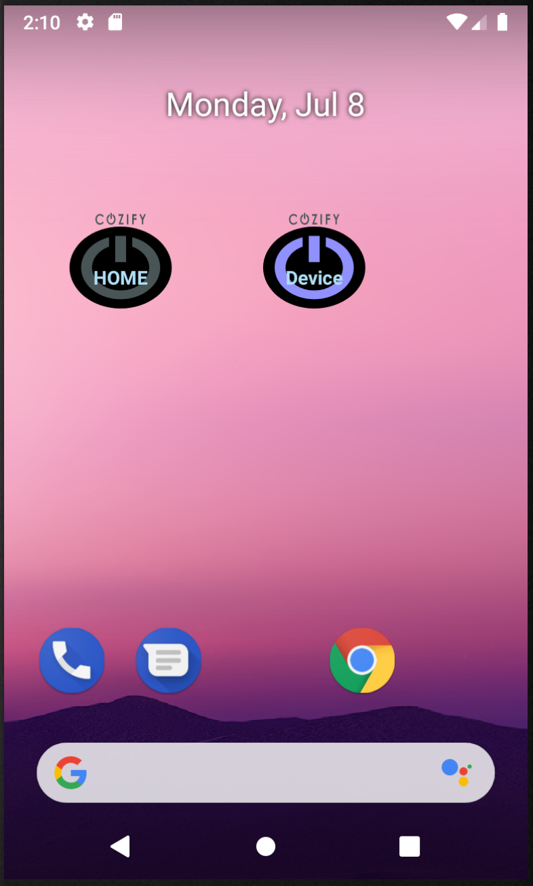

# Cozify Widget Application for Quick Control

This an appication that enables widget buttons to be created for quick ON/OFF control of Cozify Scenes or Devices on Android home screens.

When the application is lauched you need to first login to Cozify as usual with the temporary password send to give email address.
After successful login the application closes and you can start to create the widgets. The access rights are saved and shared with all widgets.

Create widget by long pressing an empty space on the home screen and select (drag and drop) the Cozify Conrol Widget to some empty place on the screen.
One widget can control one Scene or device ON / OFF. After placing configure the widget button by first selecting the target Hub and Scene or Device.
Optionally you can give a shorhand name for the button. Before creating the widget you an also test the operation with the test buttons shown.
After you create the widget the button appears on the screen.

The Icon shows wheter the Scene or Device is ON or OFF. First click of the icon only arms the button by showing a red circle. 
Second press sends the control message that toggles the state of the target Scene or device. 

You can create several widget buttons to control more Scenes or devices.

    

